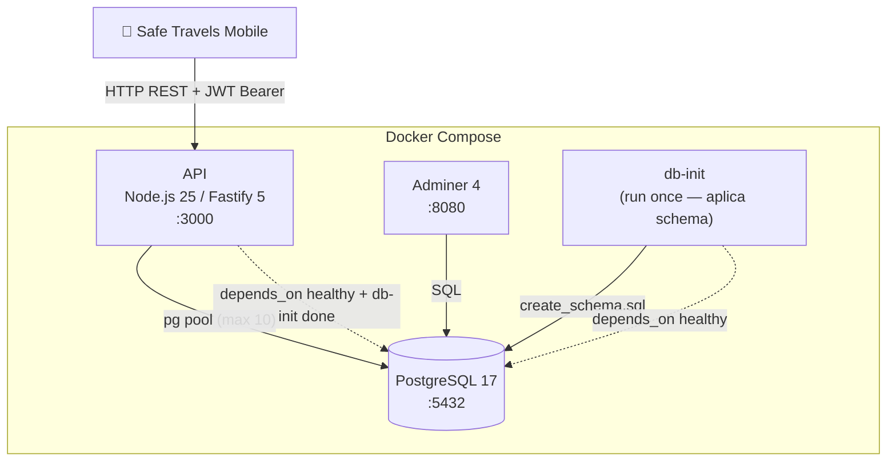
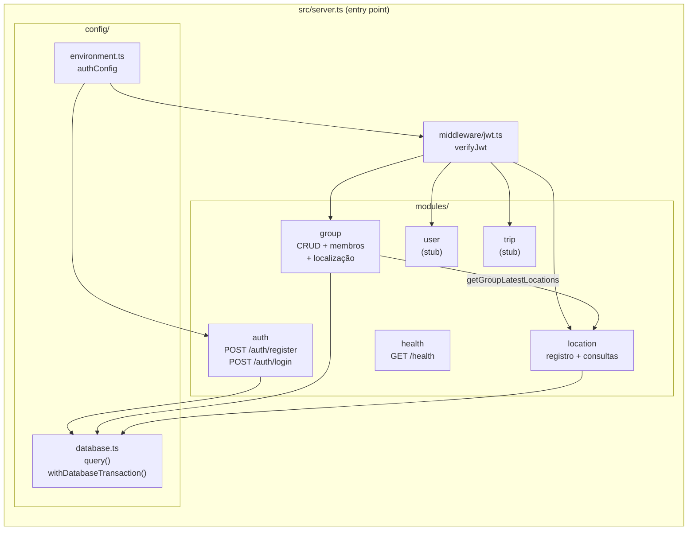
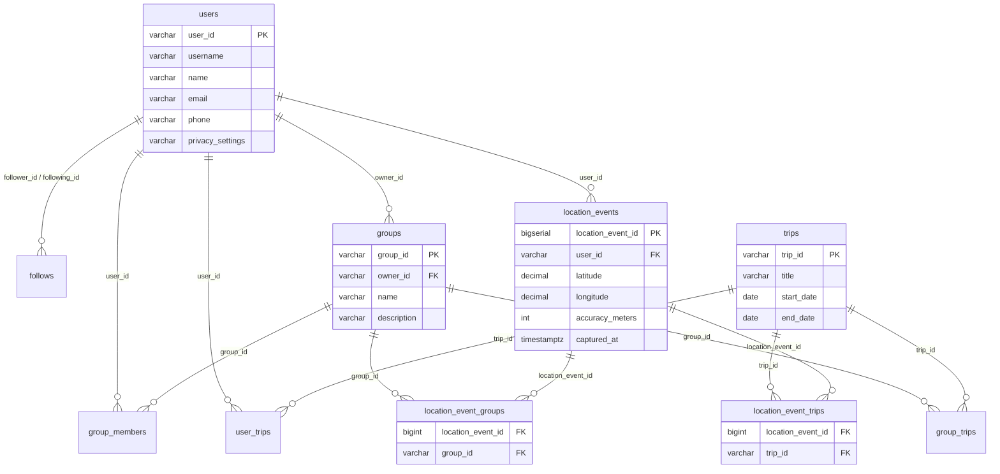

# Arquitetura — Safe Travels API

> Visualizar no VS Code: extensão **Markdown Preview Mermaid Support** ou **Markdown Preview Enhanced**
> Visualizar online: https://mermaid.live

---

## Infraestrutura (Docker Compose)

---

## Estrutura de módulos

---

## Modelo de dados (visão geral)

