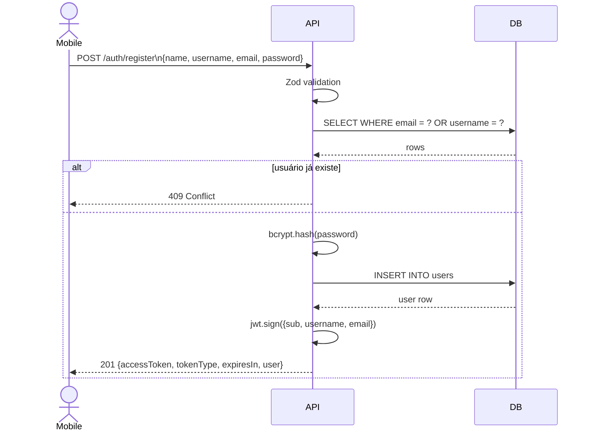
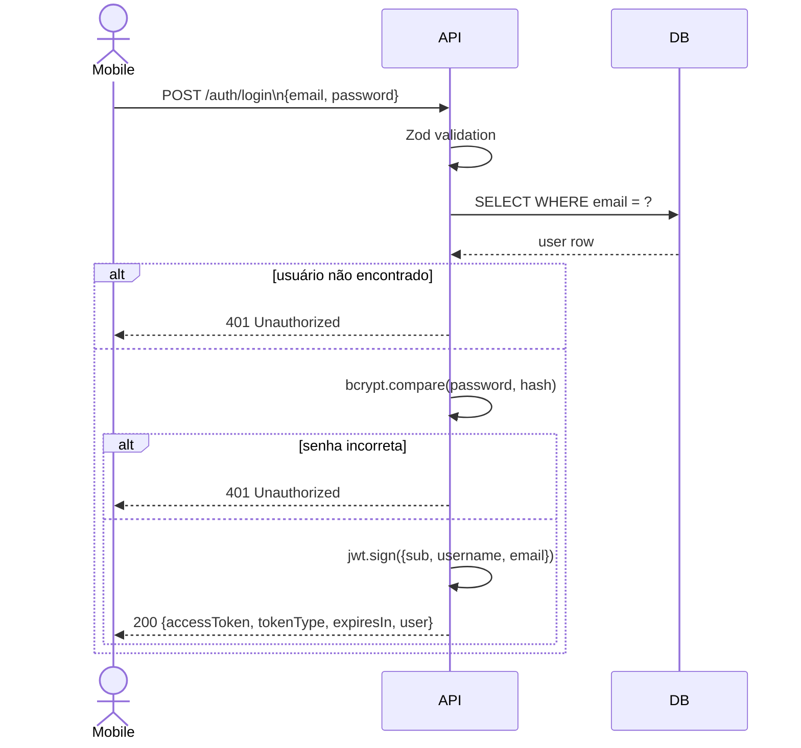
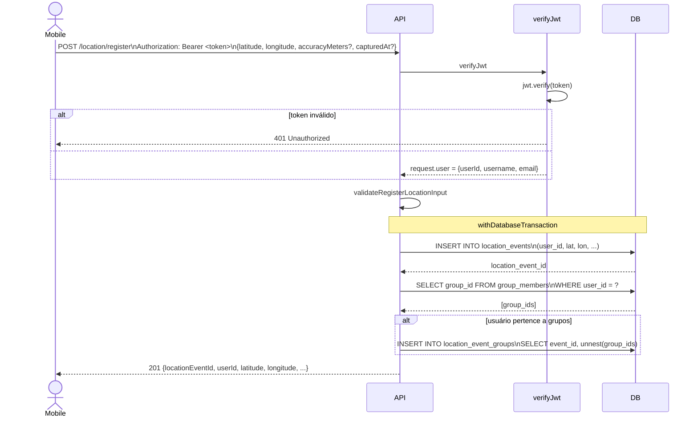
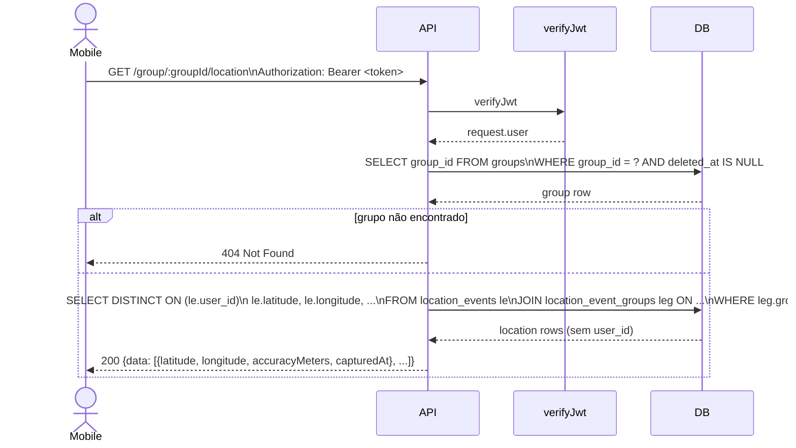
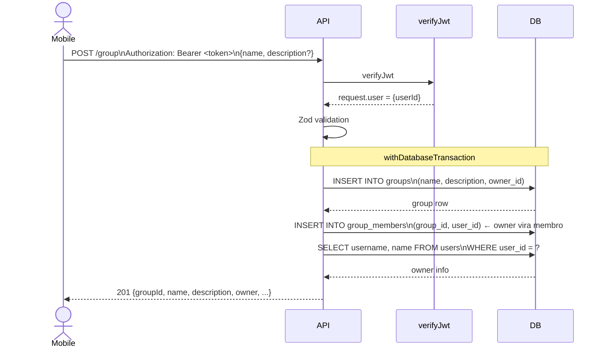

# Fluxos principais — Safe Travels API

> Visualizar no VS Code: extensão **Markdown Preview Mermaid Support** ou **Markdown Preview Enhanced**
> Visualizar online: https://mermaid.live

---

## Autenticação — Register

---

## Autenticação — Login

---

## Registro de localização (com vinculação automática a grupos)

---

## Consulta de localização do grupo

---

## Criação de grupo

